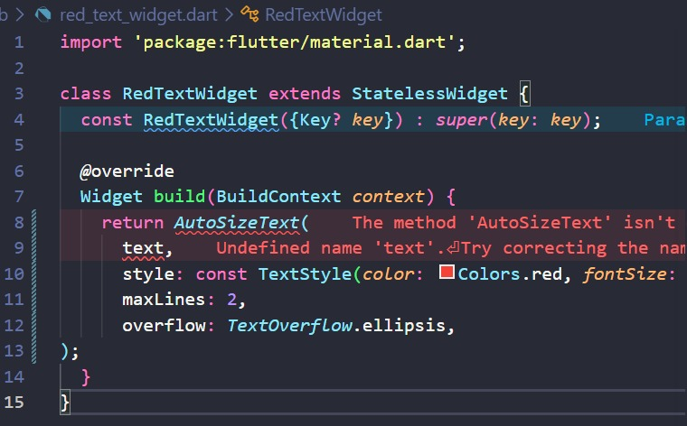
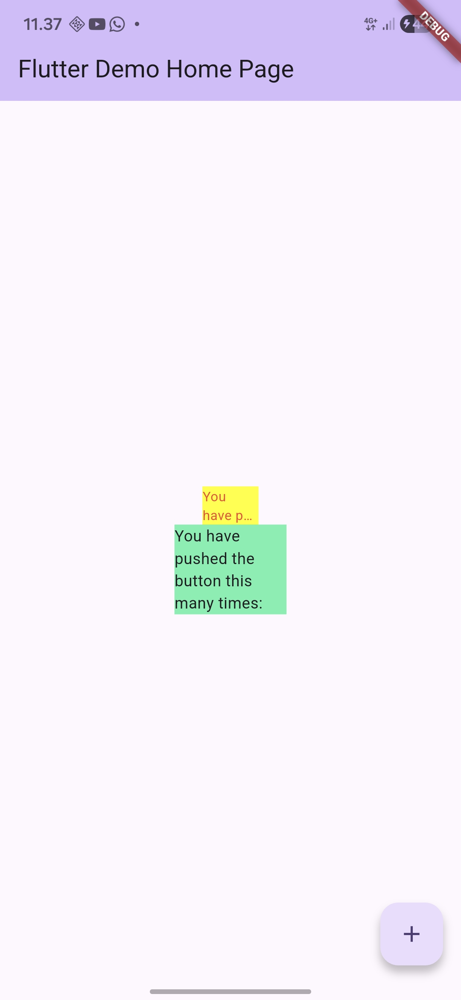

# Laporan Praktikum #07 Manajemen Plugin

## Identitas Mahasiswa

| Atribut | Nilai                   |
| ------- | ----------------------- |
| Nama    | Ratih Purnama Dewi      |
| NIM     | 244107060055            |
| Kelas   | SIB-2D                  |

---

## Praktikum Menerapkan Plugin di Project Flutter

Selesaikan langkah-langkah praktikum berikut ini menggunakan editor Visual Studio Code (VS Code) atau Android Studio atau code editor lain kesukaan Anda.

> **Perhatian:** Diasumsikan Anda telah berhasil melakukan setup environment Flutter SDK, VS Code, Flutter Plugin, dan Android SDK pada pertemuan pertama.

### Langkah 1: Buat Project Baru

Buatlah sebuah project flutter baru dengan nama `flutter_plugin_pubdev`. Lalu jadikan repository di GitHub Anda dengan nama `flutter_plugin_pubdev`.

### Langkah 2: Menambahkan Plugin

Tambahkan plugin `auto_size_text` menggunakan perintah berikut di terminal:

```bash
flutter pub add auto_size_text
```

Jika berhasil, maka akan tampil nama plugin beserta versinya di file `pubspec.yaml` pada bagian `dependencies`.

### Langkah 3: Buat file `red_text_widget.dart`

Buat file baru bernama `red_text_widget.dart` di dalam folder `lib` lalu isi kode seperti berikut.

```dart
import 'package:flutter/material.dart';

class RedTextWidget extends StatelessWidget {
  const RedTextWidget({Key? key}) : super(key: key);

  @override
  Widget build(BuildContext context) {
    return Container();
  }
}
```

### Langkah 4: Tambah Widget AutoSizeText

Masih di file `red_text_widget.dart`, untuk menggunakan plugin `auto_size_text`, ubahlah kode `return Container()` menjadi seperti berikut.

```dart
return AutoSizeText(
      text,
      style: const TextStyle(color: Colors.red, fontSize: 14),
      maxLines: 2,
      overflow: TextOverflow.ellipsis,
);
```



Setelah Anda menambahkan kode di atas, Anda akan mendapatkan info error. Mengapa demikian? Jelaskan dalam laporan praktikum Anda!

**Jawab:**
Error tersebut terjadi karena dua hal:
1. **Package belum di-import:** Kita menggunakan widget `AutoSizeText` tetapi belum mengimpor library-nya. Kita perlu menambahkan `import 'package:auto_size_text/auto_size_text.dart';` di bagian atas file.
2. **Variabel `text` belum didefinisikan:** Pada kode di atas, kita memasukkan variabel `text` ke dalam `AutoSizeText`, namun variabel tersebut belum dideklarasikan di dalam class `RedTextWidget`. Variabel ini baru akan ditambahkan pada Langkah 5.
### Langkah 5: Buat Variabel text dan parameter di constructor

Tambahkan variabel `text` dan parameter di constructor seperti berikut.

```dart
final String text;

const RedTextWidget({Key? key, required this.text}) : super(key: key);
```

### Langkah 6: Tambahkan widget di `main.dart`

Buka file `main.dart` lalu tambahkan di dalam `children:` pada class `_MyHomePageState`:

```dart
Container(
   color: Colors.yellowAccent,
   width: 50,
   child: const RedTextWidget(
             text: 'You have pushed the button this many times:',
          ),
),
Container(
    color: Colors.greenAccent,
    width: 100,
    child: const Text(
           'You have pushed the button this many times:',
          ),
),
```

Run aplikasi tersebut dengan tekan **F5**.

**Hasil:**


---

## Tugas

1. Selesaikan Praktikum tersebut, lalu dokumentasikan dan push ke repository Anda berupa screenshot hasil pekerjaan beserta penjelasannya di file `README.md`!
2. Jelaskan maksud dari langkah 2 pada praktikum tersebut!
   - **Jawab:** Perintah `flutter pub add auto_size_text` digunakan untuk menginstal package/plugin eksternal `auto_size_text` ke dalam project Flutter. Perintah ini akan mengunduh package dan secara otomatis mendaftarkannya ke file `pubspec.yaml` di bagian `dependencies`.
3. Jelaskan maksud dari langkah 5 pada praktikum tersebut!
   - **Jawab:** Langkah 5 bertujuan untuk mendeklarasikan variabel `text` dan menjadikannya parameter *required* pada *constructor* `RedTextWidget`. Tujuannya agar widget tersebut menjadi dinamis dan dapat menerima input string atau tulisan dari luar saat widget dipanggil.
4. Pada langkah 6 terdapat dua widget yang ditambahkan, jelaskan fungsi dan perbedaannya!
   - **Jawab:**
     - **Container Kuning (Lebar 50):** Menggunakan custom widget `RedTextWidget` yang di dalamnya mengimplementasikan `AutoSizeText`. Widget ini berfungsi untuk mengecilkan ukuran teks secara otomatis agar muat ke dalam batas lebar (50) dan *maxLines* (2). Teks yang berlebih dipotong dengan tanda `...` (ellipsis).
     - **Container Hijau (Lebar 100):** Menggunakan widget standar `Text` bawaan Flutter. Widget ini tidak dapat mengecilkan font secara otomatis. Akibatnya, teks berukuran statis dan bisa menyebabkan peringatan error (RenderFlex overflow) atau tulisan terpotong paksa apabila ruang yang tersedia tidak cukup.
5. Jelaskan maksud dari tiap parameter yang ada di dalam plugin `auto_size_text` berdasarkan tautan pada dokumentasi ini!
   - **Jawab:** Berdasarkan dokumentasi resmi, berikut adalah maksud dari tiap parameter `AutoSizeText`:
     - `key`: Mengontrol bagaimana satu widget menggantikan widget lain di dalam *widget tree*.
     - `textKey`: Menetapkan identifier/key untuk widget `Text` hasil *render*.
     - `style`: Gaya atau *styling* (seperti warna, *font family*) yang digunakan untuk teks.
     - `minFontSize`: Batas ukuran font terkecil yang digunakan saat menyesuaikan teks (default: 12). Diabaikan jika `presetFontSizes` diatur.
     - `maxFontSize`: Batas ukuran font terbesar yang diizinkan. Berguna jika font size diwarisi dari parent tapi ingin kita batasi maksimalnya.
     - `stepGranularity`: Ukuran per langkah (step) dalam menurunkan font size saat menyesuaikan batasan. Demi performa, nilainya sebaiknya tidak di bawah 1.
     - `presetFontSizes`: Mendefinisikan secara spesifik daftar ukuran font yang diizinkan (harus diurutkan menurun). Jika ada, ukuran akan dipilih hanya dari daftar ini.
     - `group`: Digunakan untuk menyelaraskan (*synchronize*) ukuran font dari beberapa widget `AutoSizeText` ke ukuran font terkecil di grup tersebut.
     - `textAlign`: Mengatur perataan teks secara horizontal (kiri, tengah, kanan, dsb).
     - `textDirection`: Arah penulisan teks (contoh: LTR atau RTL).
     - `locale`: Memilih font spesifik berdasarkan *locale*/bahasa.
     - `softWrap`: Menentukan apakah teks boleh membungkus ke baris baru (*wrap*) pada titik perhentian spasi standar.
     - `wrapWords`: Menentukan apakah kata-kata yang tidak muat akan dipaksa turun baris (default: `true`).
     - `overflow`: Menentukan cara penanganan visual jika teks melampaui batas ukuran.
     - `overflowReplacement`: Menampilkan widget alternatif/pengganti jika teks tidak muat dan *overflow* pada batasnya (mencegah teks yang dirender terlalu kecil).
     - `textScaleFactor`: Rasio skala font terhadap piksel logis perangkat.
     - `maxLines`: Batasan jumlah baris maksimum yang diizinkan untuk teks.
     - `semanticsLabel`: Label alternatif yang digunakan untuk fitur aksesibilitas (Screen Reader).
6. Kumpulkan laporan praktikum Anda berupa link repository GitHub kepada dosen!

---

## Tugas PBL

1. Buatlah kelompok minimal 4 mahasiswa dan maksimal 6 mahasiswa!
2. Buatlah versi aplikasi mobile dari aplikasi web ini: [http://jawara.sytes.net/](http://jawara.sytes.net/) (pastikan akses dengan HTTP bukan HTTPS di browser).
3. Buatlah hanya berupa UI/tampilan tanpa fungsional/backend, namun tetap bisa berpindah-pindah screen di flutter/mobile.
4. Buatlah repository kelompok secara private, invite teman sekelompoknya dan dosen pengampu. Jangan lupa di `README` tambahkan capture GIF hasil UI dan nama-nama anggota kelompoknya.
5. Presentasikan hasil UI aplikasi mobile tersebut pada pertemuan/minggu ke-9 sebagai nilai UTS.
